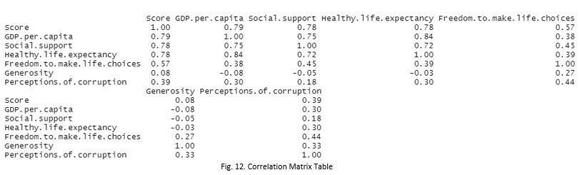

# World-Happiness-Scores

- A comprehension of people’s ideologies can be made from the world. This model predicts the happiness score 
  of any country considering factors like GDP, Life expectancy, Freedom, and Trust in government. This model 
  pertains relevancy to those who wish to explore other countries, including governments and businesses to conduct 
  foreign operations. 
  
  ## Functional specification
  
  
- The current hypothesis states that the happiness score is affected by GDP per capita, Freedom, and Life Expectancy. 
  Each of these independent variables – GDP per capita, Freedom, Life expectancy results in a positive correlation towards 
  Happiness Score.
  
  ## Descriptive statistics
  
  
  ## Correlation matrix
  
  
  ## Regression results
  
  
- F- statistic revealed to be 1787 with an adjusted R-squared of 0.98%. The null hypothesis suggested Happiness score 
  will increase as each independent variable increases as well. The alternate hypothesis agrees with the null. 
  GDP per capita, Life Expectancy, and Freedom had a positive correlation toward the dependent variable, Happiness Score. 
