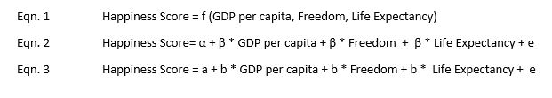
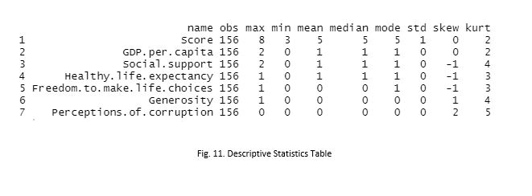
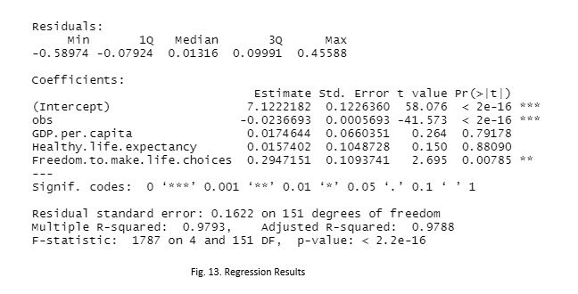

# World-Happiness-Scores

- A comprehension of people’s ideologies can be made from the world. This model predicts the happiness score 
  of any country considering factors like GDP, Life expectancy, Freedom, and Trust in government. This model 
  pertains relevancy to those who wish to explore other countries, including governments and businesses to conduct 
  foreign operations. 
  
  ## Functional specification
  
  
  ## Descriptive statistics
  
  
  ## Correlation matrix
  
  
  ## Regression results
  
